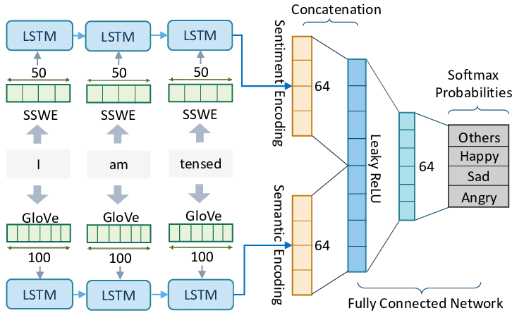

# Text Sentiment Analysis using BERT & LSTM

**Sentiment analysis** is an NLP technique to classify the sentiment (_positive_, _negative_, or _neutral_) of text data. It involves processing textual input, classifying sentiment using techniques like lexicon-based, machine learning, or deep learning models, and has applications in business, social media monitoring, finance, and healthcare. It helps understand public sentiment, customer satisfaction, and market trends.

### [Download Dataset](https://drive.usercontent.google.com/download?id=1Jp3D5gdxGrwa5dHbr4p-pECrD8wi7vik&authuser=0)

### Text Sentiment Analysis using BERT

**BERT** is pre-trained on a large text corpus using tasks like masked language modeling and next sentence prediction. Fine-tuning on specific tasks involves adjusting the final layers of the pre-trained BERT model which allows us to adapt it to specific NLP tasks such as **text classification**, **named entity recognition**, **sentiment analysis**, and **question answering**.

### Text Sentiment Analysis using LSTM

For LSTM Model, the **Embedding Layer** converts tokens into **dense vectors** to capture word **similarities**. The **LSTM Layer** processes **sequences**, maintaining **hidden states** for **long-term dependencies**. A **Dropout Layer** prevents **overfitting** by randomly setting input units to **zero**. The **Fully Connected Layer** transforms LSTM output, and a **Sigmoid Activation Function** squashes values to predict **sentiment probabilities**. This architecture effectively analyzes text for **sentiment classification**.

>Note: Above image is not correct representation of LSTM model defined in my notebook. It is just a representation of how LSTM works on text sentiment analysis. 

---
Feel free to send issues if you face any problem. 
Don't forget to star the repo :star: 