# Sentiment Analysis with RNN-Based Additive Attention and Transformers

**Sentiment Analysis** is a Natural Language Processing (NLP) technique used to classify the sentiment of text data as _positive_, _negative_, or _neutral_. It involves processing textual input and classifying sentiment using methods such as lexicon-based approaches, machine learning, or deep learning models. This technique has applications in areas like business, social media monitoring, finance, and healthcare, enabling insights into public sentiment, customer satisfaction, and market trends.

This repository implements and compares various deep learning models for sentiment analysis, including:
- Sequential __RNN based models with additive attention__ mechanisms
- Fine-tuning __Transformer models__ 

for binary and multi-class sentiment classification.

> Deployed the **LSTM + Attention** trained on larger dataset in streamlit.[**Click here**](https://sentimentsense.streamlit.app/) to try it out.

## Binary Text Sentiment Analysis

> [!NOTE] 
> Custom embeddings using the training dataset vocabulary were employed for this RNN-based model experiment.  
> Total epochs trained: `15` (RNN) & `5` (Transformer). The best model was chosen based on test accuracy.  

|  RNN Models     | Best Epoch | Train Loss | Test Loss | Train Acc | Test Acc |
|------------------|------------|------------|-----------|-----------|----------|
| LSTM + Attention | 13         | 0.2499     | 0.344    | 0.8986    | 0.8572  |   
| **BiLSTM + Attention** | **6**        | **0.286**     | **0.3349**    | **0.8795**    | **0.8624**   |
| GRU + Attention  | 12        | 0.2514     | 0.3289    | 0.8972    | 0.8522   |
| BiGRU + Attention  | 8         | 0.2433     | 0.3672    | 0.8998    | 0.8535   |

|  RNN Models  (Larger Dataset)  | Best Epoch | Train Loss | Test Loss | Train Acc | Test Acc |
|------------------|------------|------------|-----------|-----------|----------|
| **LSTM + Attention** | **8**        | **0.1783**     | **0.2223**     | **0.9228**   | **0.9086**  |
| GRU + Attention  | 7        | 0.1857     | 0.2225    | 0.8972    | 0.9079   |

|  Transformer Models | Best Epoch | Train Loss | Test Loss |Test Acc |
|------------------|------------|------------|-----------|-----------|
| Distil-BERT-base-uncased | 3         | 0.0968    | 0.2511   | 0.9293  |   
| **RoBERTa-base** | **5**         |  **0.0339**	  |**0.2595**  | **0.9495**  |   
		

### Confusion Matrix

| LSTM + Attention | BiLSTM + Attention | GRU + Attention |BiGRU + Attention |
|------------------|------------|------------|-----------|
| 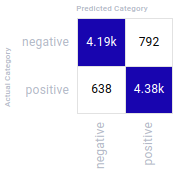 | 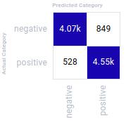 | 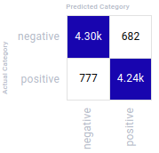  |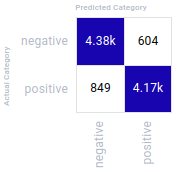 |

| LSTM + Attention (larger datset) | GRU + Attention (larger datset)| Distil-BERT-base-uncased | RoBERTa-base |
|------------------|------------|------------------|------------|
| 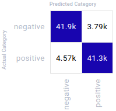 | 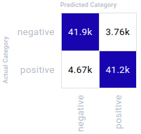 | 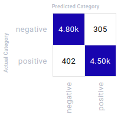|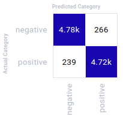|

## MultiClass Text Sentiment Analysis

> [!NOTE]
> `Small Spacy Embeddings` were used for this experiment. 

| Model            | Best Epoch | Train Loss | Test Loss | Train Acc | Test Acc |
|------------------|------------|------------|-----------|-----------|----------|
| LSTM + Attention | 23         | 0.5530     | 0.7040    | 0.7748    | 0.7124   |
| BiLSTM + Attention | 14       | 0.5572     | 0.6687    | 0.7680    | 0.7235   |
| GRU + Attention  | 21         | 0.5742     | 0.6618    | 0.7629    | 0.7250   |
| **BiGRU + Attention** | **22**        | **0.5099**     | **0.6593**    | **0.7893**    | **0.7335**   |

|  Transformer Models | Best Epoch | Train Loss | Test Loss |Test Acc |
|------------------|------------|------------|-----------|-----------|
| Distil-BERT-base-cased | 3 | 0.3913 | 0.5507	| 0.7852 | 
| RoBERTa-base | 2       |  0.4013	  | 0.4904  | 0.8123  |  
| **RoBERTa-large** | **4**         |  **0.2272**	  |**0.5990**  | **0.8117**  |  
			
### Confusion Matrix

| LSTM + Attention | BiLSTM + Attention | GRU + Attention |BiGRU + Attention |
|------------------|------------|------------|-----------|
| 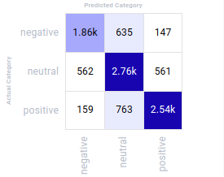 |  | 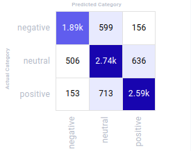  |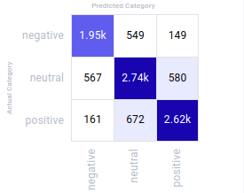 |

| Distil-BERT-base-cased | RoBERTa-base |RoBERTa-large |
|------------------|------------|------------|
|  | 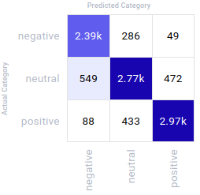 | 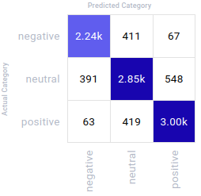 |

> [!NOTE]
> All the RNN based model experiments metrics are logged and each trained model and vocab files are uploaded under __Assets & Artifacts tab__ to Comet-ML.
> [__Link__](https://www.comet.com/luluw8071/tweet-sentiment-analysis/view/new/panels)

---
Feel free to send issues if you face any problem. Don't forget to star the repo :star: 
